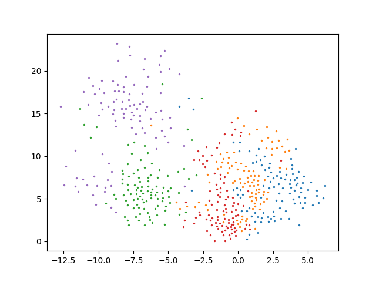
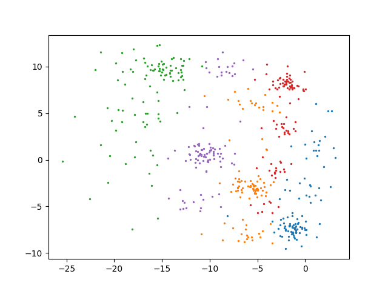
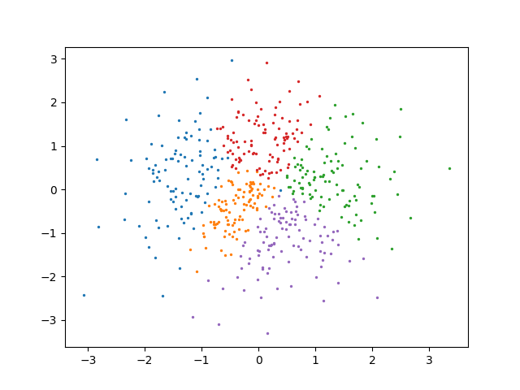

# Text Autoencoders

The project contains an implementation of the toy example from the paper [Educating Text Autoencoders: Latent Representation Guidance via Denoising](https://arxiv.org/abs/1905.12777) with an encoder based on MLP-Mixers.

It supports classic autoencoders as well as variational autoencoders (VAE) and adversarial autoencoders (AAE). The paper studies the effect of noise on latent space geometry.

## The dataset

The dataset is a toy example of text sequences of length 50 with a vocabulary of size 2 (e.g. "0 1 1 1 0 ... 0 0"). We create 5 such sequences randomly (they are the 5 clusters' centers) and then we create 100 sequences per cluster by randomly flipping 20% of the symbols of the cluster's center.

## The encoder

The sentences are first embedded with an embedding layer and then fed into the encoder.
The encoder is an MLP-Mixer where the number of channels is the number of symbols in the sequence (e.g. 50) and the number of tokens is the embedding size.
The output of the Mixer is projected with a linear layer to get a number of tokens equal to the latent size. We then average the number of channels to get the latent representation.

## The decoder

The decoder is an LSTM with a single layer. Its initial hidden state is created by applying a linear transformation to the latent space.
At each step of the decoding, the input of the LSTM is the latent vector.
The output of the decoder is then passed through a linear layer to get the logits.

## Training procedures

The three training procedures can be combined with denoising by applying noise on the input and computing the reconstruction loss with the unaltered sequence.

### Classic Autoencoder

For this procedure, we only optimize for the reconstruction loss.

### Variational Autoencoder

In addition to the reconstruction loss, we compute the KL divergence of the latent space. To do that, we need to get the mean and standard deviation of the latent space representation. This is done by adding two linear layers to the model and applying the reparametrization trick [[1]](#1).
The KL loss is weighted by a parameter $\lambda_{KL}$.

### Adversarial Autoencoder

We introduce a second network (the discriminator) that is charged to guess if a latent vector was generated by the encoder or is from a prior distribution. The prior distribution doesn't need to have a closed form (unlike the VAE). The autoencoder is trained to reduce the reconstruction error and to fool the discriminator (it is the adversarial loss) [[2]](#2).

## Results

We trained the same model on the same data with the three procedures and both with and without noise.

|| AE             |  VAE | AAE |
:-------:|:-------------------------:|:-------------------------:|:-------:
No denoising |  |   | 
Denoising |  |   | 

These models can correctly predict about 80% of the words (which is the proportion of words that samples from the same group have in common).

We also trained the model with a uniform and centered prior.

|| AAE |
:-------:|:-------------------------:
No denoising |  
Denoising | 

## References
<a id="1">[1]</a>  Kingma, Diederik P., and Max Welling. "Auto-encoding variational Bayes." arXiv preprint arXiv:1312.6114 (2013).

<a id="2">[2]</a> Makhzani, Alireza, et al. "Adversarial autoencoders." arXiv preprint arXiv:1511.05644 (2015).